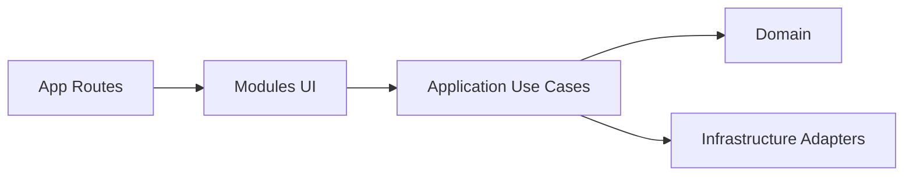

# Tena Asesores — Landing Site

Landing page para [Tena Asesores](https://tenaasesores.es), basada en Next.js App Router.


## Stack (cards)

| Capa | Tecnología | Rol |
|---|---|---|
| Frontend App | `Next.js 16` + `React 19` | Renderizado, rutas App Router y páginas públicas |
| UI System | `Tailwind CSS 4` + `tw-animate-css` | Estilos, utilidades, motion ligera |
| Motion | `Framer Motion` + `GSAP` | Animaciones de secciones y microinteracciones |
| Tipado | `TypeScript (strict)` | Contratos estables y mantenimiento futuro |
| Tooling | `pnpm` | Gestión de dependencias/scripts |

## Snapshot rápido

- **Dominio:** asesoría/landing corporativa.
- **Objetivo:** marketing + contacto + escalabilidad futura (módulos).
- **Estado:** arquitectura modular en marcha con entrypoints por dominio.

## Arquitectura adoptada

El proyecto usa una arquitectura **modular por dominio** con enfoque hexagonal pragmático:

- `domain`: tipos y reglas de negocio puras.
- `application`: casos de uso.
- `infrastructure`: adaptadores a servicios externos.
- `ui`: componentes y composición visual.

No es hexagonal "académica" estricta, sino una versión adaptada a producto web frontend-first.



## Estructura actual (objetivo de mantenimiento)

```text
app/
  (site)/
src/
  modules/
    contact/
      domain/
      application/
      infrastructure/
      ui/
    landing/
      ui/
  shared/
    config/
components/
  landing/
  layout/
  pages/
content/
```

## Dónde tocar cada cosa

- **Texto/copy y contenido del sitio**:
  - preferente: `src/shared/config/site.ts`
  - compatibilidad legada: `content/site.ts`
- **UI de páginas landing**:
  - punto de entrada recomendado: `src/modules/landing/ui/index.ts`
- **UI y lógica de contacto**:
  - UI: `src/modules/contact/ui/index.ts`
  - dominio/casos de uso/adaptadores:
    - `src/modules/contact/domain/`
    - `src/modules/contact/application/`
    - `src/modules/contact/infrastructure/`
- **Rutas Next.js**:
  - `app/(site)/*`

## Reglas de arquitectura

1. UI no debe contener lógica de integración externa compleja.
2. Casos de uso (`application`) orquestan dominio + infraestructura.
3. Dominio no depende de framework ni de detalles de red/email.
4. Nuevos módulos deben replicar la misma estructura (`domain/application/infrastructure/ui`).
5. Importar preferentemente desde entrypoints de módulo (`src/modules/*/ui`).

## Flujo recomendado para nuevas features

1. Crear/modificar tipos en `domain`.
2. Implementar caso de uso en `application`.
3. Conectar adaptador en `infrastructure`.
4. Exponer UI desde `src/modules/<modulo>/ui/index.ts`.
5. Consumir desde rutas de `app/`.

## Desarrollo

```sh
pnpm install
pnpm dev
```

Abre [http://localhost:3000](http://localhost:3000).

## Scripts

```sh
pnpm dev      # desarrollo local
pnpm build    # build producción
pnpm start    # servir build
pnpm lint     # lint (requiere eslint instalado en deps)
```

## Verificación local

```sh
pnpm exec tsc --noEmit
pnpm build
```

## Producción

```sh
pnpm build
pnpm start
```

## Seguridad y documentación sensible

- No subir manuales internos de identidad corporativa ni documentación confidencial al repositorio.
- Revisar siempre `docs/` antes de cada commit.
- Mantener secretos en variables de entorno y nunca en código fuente.
